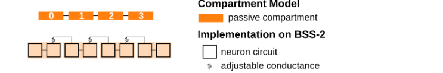
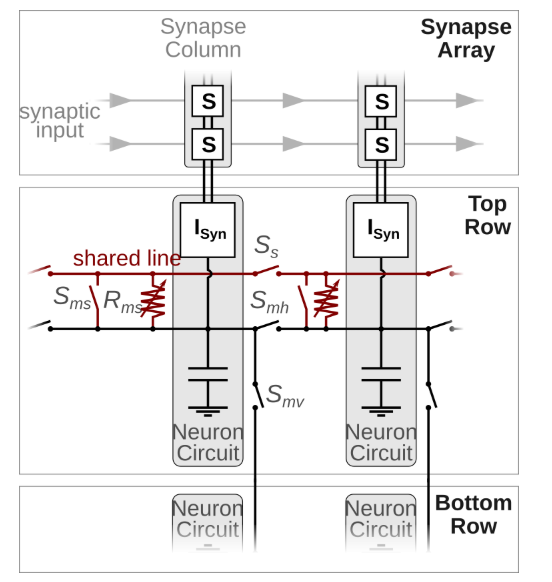

# Challenge #24: Simulation on the EBRAINS BrainScaleS-2 Neuromorphic Hardware

## Objective
The purpose of this challenge was to run a simulation on the EBRAINS BrainScaleS-2 hardware and explore its neuromorphic capabilities using the PyNN framework.

---

## 🔍 What is EBRAINS?

[EBRAINS](https://www.ebrains.eu) is a European open research infrastructure offering tools, data, and computing resources for brain-related research. It includes access to cutting-edge neuromorphic hardware such as BrainScaleS-2.

---

## ✅ Learning Goals

- Run a simple simulation on the EBRAINS BrainScaleS-2 hardware.
- Explore BrainScaleS-2’s interface and capabilities.
- Use the PyNN library for simulation interaction.

---

## 📝 Steps Completed

### 1. EBRAINS Account and Access
- Registered for a free account via the [EBRAINS Neuromorphic Platform Access Page](https://wiki.ebrains.eu/bin/view/Collabs/neuromorphic/Getting%20access).
- Gained access to the platform and joined a designated Collab workspace.

### 2. BrainScaleS-2 Demo Setup
- Accessed the BrainScaleS-2 demos at:  
  [https://electronicvisions.github.io/documentation-brainscales2/latest/brainscales2-demos/tutorial.html](https://electronicvisions.github.io/documentation-brainscales2/latest/brainscales2-demos/tutorial.html)

### 3. Selected and Ran a Demo
- Chose the `tp_00-introduction` demo for matrix multiplication.
- Executed the simulation directly on BrainScaleS-2 hardware via the web interface.

### 4. Observations
- Successfully ran neuromorphic computation for a matrix operation.
- Explored configuration of neuron circuits, adjustable conductances, and multi-compartment models.
- Confirmed interaction through PyNN scripting.

---

## 🧠 Visual Documentation

### Multicompartment Chain Model (Neuron Circuit Implementation)

### Neuron Circuit Connections via Shared Line and Switches

---

## ✅ Outcome

This challenge offered valuable hands-on exposure to neuromorphic hardware systems and PyNN simulation design. It demonstrated how computational neuroscience models can be deployed to real silicon circuits, paving the way for high-speed and energy-efficient brain-inspired computing.

---

## 📚 References

- [BrainScaleS-2 Demos](https://electronicvisions.github.io/documentation-brainscales2/latest/brainscales2-demos/tutorial.html)
- [PyNN Framework](https://neuralensemble.org/PyNN/)
- [EBRAINS Platform](https://www.ebrains.eu)
